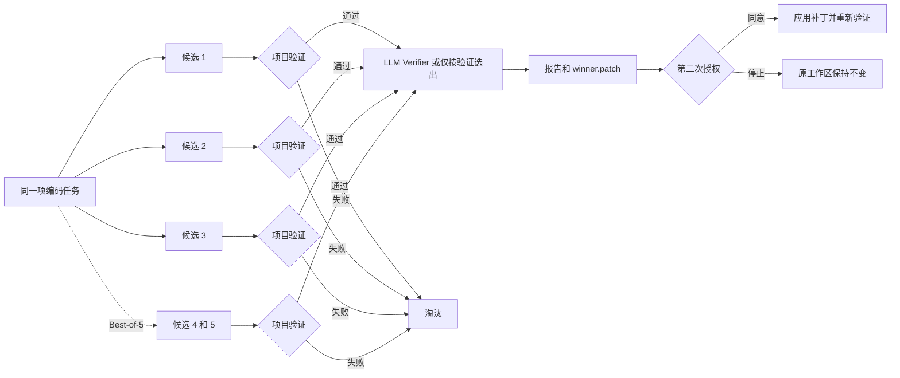

# dsh-llm-verifier

<p align="center">
  <strong>让多个 Coding Agent 独立生成补丁，先用项目测试淘汰失败方案，再由 LLM Verifier 排名；只有你二次授权后，获胜补丁才会写入原仓库。</strong>
</p>

<p align="center">
  <a href="README.md">English</a>
</p>

<p align="center">
  
  
  
  <a href="LICENSE"></a>
</p>

`dsh-llm-verifier` 是面向 [DeepSeek Harness](https://github.com/deepseek-ai/deepseek-harness) 的开发者预览插件。它会让 **3 个或 5 个候选 Agent** 在各自的 detached Git worktree 中完成同一项编码任务，逐个执行项目验证，只把通过验证的补丁交给 [`llm-verifier`](https://pypi.org/project/llm-verifier/) 排名。候选生成和排名期间，原工作区保持不变；应用获胜补丁需要第二次明确授权。

> [!WARNING]
> 当前公开版本只适合处理**可信仓库**。候选生成使用 detached Git worktree 和 DeepSeek Harness `workspace-write` 权限模式，但验证命令仍会在宿主机执行目标仓库代码。使用前请阅读[安全边界](#安全边界)。

## 为什么做这个项目

同一个 Coding Agent 对同一个任务进行多次独立尝试，可能得到质量明显不同的补丁：某个候选修复更简单，某个候选补充了更完整的测试，另一个候选可能引入隐藏回归。手动运行并比较多个候选，又会带来新的编排和评审成本。

这个插件把流程收敛为一次带审批的纵向工作流：

1. 所有候选接收完全相同的编码任务。
2. 候选修改分别保存在 detached Git worktree。
3. 先执行确定性的项目验证，再进行模型排名。
4. 验证失败的候选直接淘汰。
5. 多个合格补丁需要比较时，由 LLM Verifier 排名。
6. 生成可审计报告和获胜补丁。
7. 用户第二次授权后才应用补丁，并重新执行原验证命令。



## 核心能力

- **Best-of-3 / Best-of-5：** 默认 3 个候选，高价值任务可选择 5 个。
- **验证优先：** 测试失败的候选不会进入模型排名。
- **受控排名：** 只有一个候选通过时直接胜出；两个候选使用一个 pivot；三个至五个候选使用两个 pivots。
- **两次审批：** 首次审批允许候选执行，第二次审批允许应用获胜补丁。
- **应用前完整性复核：** 再次校验仓库路径、基础 `HEAD`、干净状态和补丁 SHA-256。
- **可审计产物：** 报告记录候选名次、变更文件、耗时、进程状态、补丁哈希、Verifier 请求数和 Token 用量。
- **凭据控制：** 验证进程不会收到 DeepSeek API Key；候选日志、错误、验证输出和文本 diff 会依据精确凭据值进行脱敏。
- **不自动操作 Git：** 不会自动 commit、push、stash、reset 或应用补丁。

## 当前状态

| 项目 | 当前公开版本 |
|---|---|
| 阶段 | 开发者预览 |
| DeepSeek Harness | 固定 `0.1.2-rc.1` |
| Node.js | `24.x` |
| Python Bridge | 由 `uv` 管理；Python `>=3.9,<3.14` |
| `llm-verifier` | 固定 `0.2.0` |
| 平台 | macOS、Linux、Windows（见限制） |
| 候选数量 | `3` 或 `5`；默认 `3` |
| 分发方式 | 从源码构建后，通过本地路径安装 |
| License | MIT |

## 快速开始

### 前置条件

准备以下环境：

- DeepSeek Harness `0.1.2-rc.1`
- Node.js 24、pnpm `11.7.0`
- [`uv`](https://docs.astral.sh/uv/)
- Git
- Harness 可通过凭据引用 `DEEPSEEK_API_KEY` 取得 DeepSeek 凭据

### 1. 克隆、安装并验证

```bash
git clone https://github.com/Web0926/dsh-llm-verifier.git
cd dsh-llm-verifier

pnpm install --frozen-lockfile
uv sync --frozen --project python
pnpm run check
```

### 2. 加入 Web profile

```bash
dsh plugin --profile web add "$(pwd)"
dsh plugin --profile web list
```

### 3. 在干净且可信的目标仓库启动 Harness

```bash
cd /path/to/a/clean-and-trusted-git-repository
dsh --profile web
```

可以在对话中这样要求 Harness：

```text
使用 verified_best_of，让 3 个候选修复登录重试问题并补充回归测试。
使用 pnpm test 验证，先不要应用获胜补丁。
```

对应工具输入：

```json
{
  "task": "修复登录重试问题并补充回归测试",
  "candidateCount": 3,
  "validationCommands": ["pnpm test"]
}
```

工具会返回 run ID、运行状态、合格候选数量、排名、报告路径、Token 用量，以及存在获胜者时的 `winner.patch` 本地路径。

检查报告和补丁后，再通过 `apply_verified_winner` 传入：

```json
{
  "runId": "<verified_best_of 返回的 runId>"
}
```

插件会再次请求授权，应用后重新运行原验证命令。

### 4. 卸载

```bash
dsh plugin --profile web remove dsh-llm-verifier
```

## 工具

### `verified_best_of`

完成候选生成、项目验证和获胜者选择，期间不修改原工作区。

| 参数 | 必填 | 说明 |
|---|---:|---|
| `task` | 是 | 所有候选共享的编码任务。 |
| `candidateCount` | 否 | `3` 或 `5`，默认 `3`。 |
| `validationCommands` | 否 | 显式验证命令；省略时自动识别一种受支持的根项目类型。 |

可能的运行状态为 `winner_selected`、`no_winner` 和 `failed`。

### `apply_verified_winner`

在单独审批后应用一个已选出的获胜补丁。应用前再次检查仓库身份和状态、基础提交及补丁 SHA-256，随后重新运行原始验证命令。

## 自动验证识别

显式命令优先。没有显式命令时，仓库根目录必须只匹配一种受支持项目类型：

| 根目录标识 | 命令 |
|---|---|
| `package.json`、唯一 JavaScript 包管理器、`test` script | 对应包管理器的 `test` 命令 |
| `pyproject.toml` | `uv run pytest` |
| `Cargo.toml` | `cargo test` |
| `go.mod` | `go test ./...` |
| 带 `test` target 的 `Makefile` | `make test` |

同时匹配多种项目类型、存在多个 JavaScript 包管理器或无法识别时，插件会 fail fast，并要求用户显式提供命令。

## 安全边界

插件对仓库修改、凭据和产物采取保守策略，但当前公开版本尚未形成容器级隔离边界。

- 只接受普通、干净的 Git 仓库根目录。
- 拒绝子模块、稀疏检出、linked worktree 和未提交修改。
- 候选工作区位于 `$DSH_HOME/llm-verifier/runs/<runId>` 下的 detached worktree。
- 候选 Harness 显式使用 `workspace-write`，不会继承宿主的 `DSH_PERMISSION_MODE`。
- 验证命令会在宿主机执行仓库代码；当前版本只应处理可信仓库与可信验证命令。
- 验证进程不会收到 API Key。
- 候选把精确凭据写入文本、二进制内容或符号链接目标时，整个候选立即失效。
- 二进制内容不会发送给 Verifier，完整 binary patch 只保存在本地。
- 取消或超时会终止候选进程组，并尝试清理插件创建的 worktree。
- 应用失败后保留现场供检查，不会自动执行 `git reset` 回滚。

每次都应阅读审批提示，尤其关注首次审批展示的验证命令。

## 运行产物

```text
$DSH_HOME/llm-verifier/runs/<runId>/
├── artifacts/
├── manifest.json
├── report.md
├── winner.patch
└── apply-result.json        # 仅在尝试应用后生成
```

报告会记录候选启动、完成、通过验证和进入排名的数量，退出码与耗时、diff stat、补丁路径与 SHA-256、日志路径、二进制文件元数据、Verifier 请求数和 Token 用量。发送给 Verifier 的材料发生截断时，报告会指向完整本地产物。

## 成本提示

默认三项评审标准、每项重复两次时，全部候选合格的 Best-of-3 约产生 **36 次 Verifier 请求**，Best-of-5 约产生 **72 次**。实际请求数会受合格候选和缓存命中影响，并写入报告。

真实候选和 Verifier 运行会产生模型费用；自动测试不会调用真实 DeepSeek API。

## 配置

默认值：

| 配置 | 默认值 |
|---|---:|
| `defaultCandidateCount` | `3` |
| `candidateProfile` | `headless` |
| `credentialRef` | `DEEPSEEK_API_KEY` |
| `verifierModel` | `deepseek-v4-flash` |
| `nEvaluations` | `2` |
| `maxVerifierWorkers` | `8` |
| `verifierEffort` | `high` |
| `verifierMaxTokens` | `32768` |
| `candidateTimeoutMs` | `1200000` |
| `validationTimeoutMs` | `600000` |
| `runTimeoutMs` | `2700000` |
| `maxVerifierTraceBytes` | `524288` |
| `stateDirectory` | `$DSH_HOME/llm-verifier` |

可在 Web profile 的 `cordis.patch.yml` 中覆盖配置：

```yaml
- id: llm-verifier
  config:
    defaultCandidateCount: 3
    candidateProfile: headless
    credentialRef: DEEPSEEK_API_KEY
    verifierModel: deepseek-v4-flash
    nEvaluations: 2
    maxVerifierWorkers: 8
    verifierEffort: high
    verifierMaxTokens: 32768
    candidateTimeoutMs: 1200000
    validationTimeoutMs: 600000
    runTimeoutMs: 2700000
    maxVerifierTraceBytes: 524288
    stateDirectory: $DSH_HOME/llm-verifier
```

`nEvaluations` 支持 `1`–`4`，`maxVerifierWorkers` 支持 `1`–`16`，`verifierEffort` 支持 `low`、`high`、`max`。`verifierModel` 必须以 `deepseek-` 开头。

## 开发验证

```bash
pnpm run typecheck
pnpm test
pnpm run build
python3 -m py_compile python/verifier_bridge.py
```

测试覆盖 Best-of-3 / Best-of-5 合格候选矩阵、补丁篡改、凭据脱敏、Verifier 故障、应用后验证失败、二进制补丁、输入截断和残留进程清理。

提交修改前请阅读 [CONTRIBUTING.md](CONTRIBUTING.md)。Bug 报告应只包含脱敏证据，禁止提交凭据或私有仓库正文。

## 当前限制

- Windows 支持通过 `cmd.exe` 与 `taskkill /T /F` 执行候选、验证与清理；Windows 无法表达的 POSIX 专属能力（进程组残留进程检测）被跳过，因此 Windows 上不会检测到遗留后台进程的候选。
- 不支持脏工作区、子模块、稀疏检出或 linked worktree。
- 候选数量固定为 3 或 5。
- 不自动 commit、push、merge 或应用补丁。
- 不支持 OpenAI、Vertex、vLLM 等其他 Verifier 后端。
- 暂无自定义 Web UI、ProgressTracker 或提前停止。
- 仅支持源码构建和本地路径安装，尚未发布 npm 包或预构建 GitHub Release。

## License

[MIT](LICENSE)
