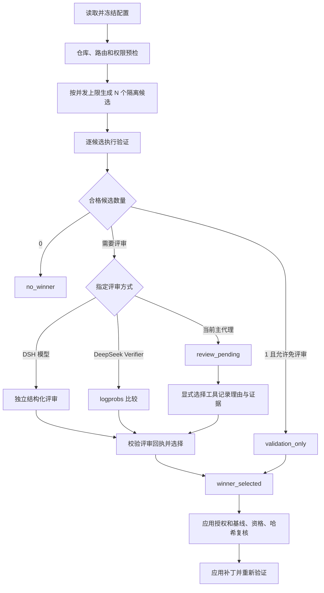

# DSH LLM Verifier 插件配置页与可选评审者开发设计

日期：2026-09-06。状态：**开发设计，尚未实现**。

目标仓库：`G:\zcode-project\llm-verify\dsh-llm-verifier`。

核对基线：`2656f99985e7bba4a86f31c9206c2ee200ed7350`，插件 `0.2.0`，本机安装的 DSH `0.1.2-rc.1`。

## 1. 交付目标与范围

用户在 DSH 的 **设置 → 插件 → 插件配置 → LLM Verifier** 中完成日常配置，无须编辑 YAML 或记忆工具参数。必须能设置生成几个候选答案、由谁生成、由谁评审，以及验证、并发、超时和评审规则。

本项目的“答案”是同一编码任务产生的代码补丁与完成说明，不把纯聊天回答评价纳入本次实现。

本轮交付本文及当前检查结果。后续实现必须同时交付配置表单、原生持久化、运行时读取、真实模型回执及正式实例页面验收。仅增加表单、schema 或 README 不算完成。

优先完成一个可配置的评审者。多个评审者投票、混合模型逐候选分配、工作流画布、独立管理网站和插件市场发布不纳入本版。

## 2. 当前事实与证据边界

### 2.1 本机已核对

| 检查项 | 实际结果 | 能证明什么 |
|---|---|---|
| 本地检查 | 前一轮执行 `pnpm run check`：类型检查及构建成功，22 通过、0 失败、2 个 POSIX 测试跳过 | 当前代码的本地回归通过 |
| 插件工具 | `verified_best_of`、`apply_verified_winner`、`rollback_verified_winner` | 三个工具已在代码中注册 |
| 可配数量 | `CandidateCount = 3 \| 5` | 当前不能设置 1、2、4 个候选 |
| 配置字段 | `src/index.ts` 定义 13 项 Config | 配置文件支持这些字段，不等于页面可编辑 |
| 评审路径 | 一个合格候选走 `validation_only`；多个合格候选有凭据走 Python verifier，无凭据走 `parent_agent_review` | 当前由凭据是否存在决定路径 |
| 无凭据结果 | 先把第一个合格候选写为 `winner_selected`，再提示主代理复核 | 这不是独立评审已经完成的证明 |
| 页面接入 | 插件未声明 `dsh.client` / `./client`，也未注册 `ctx.settings` 命名空间和 `settings.plugin.item` 卡片 | 缺少配置页的原生接入链 |
| 已安装包 | Web profile 从本地 `dsh-llm-verifier-0.2.0.tgz` 安装 | 源码目录修改后仍需重新打包安装 |
| 构建文件 | 源码仓库与 profile 安装副本的 `lib/index.js` SHA256 均为 `0d9b1b205a22c27c0852ac33277bc1b5eeb7d4d20bf7840b6065745f54b1106a` | 磁盘副本相同，不代表 3180 进程已重载 |

源码锚点（相对上述仓库，行号以核对基线为准）：

- `src/index.ts:17`：Config 字段、默认值和校验；`:227` 注册工具时一次性解析配置；`:268` 提示主代理复核。
- `src/config.ts:1`：候选数量类型和 `normalizeCandidateCount`。
- `src/core.ts:250`：候选子进程；`:279` 只有 profile 和任务参数；`:683` 所有候选同时启动。
- `src/core.ts:719`：合格候选筛选；`:733` 单候选分支；`:742` 缺少凭据时的临时赢家。
- `src/core.ts:924`：manifest 读取只接受 `winner_selected`；`:1014` 手选候选分支。
- `python/verifier_bridge.py:19`：固定三条评审标准；`:78` 只接受 2–5 个评审输入。
- `README.zh-CN.md:229`：当前配置说明；`:291`：暂无自定义 Web UI。

### 2.2 浏览器与正式实例检查

本轮按用户要求调用 Codex 内置浏览器打开 `http://127.0.0.1:3180/`，并尝试本机日志提供的认证入口。未取得可见页面、DOM 或截图：

```text
Timed out running CDP command "Page.navigate" for tab 1
Timed out running CDP command "Emulation.setFocusEmulationEnabled" for tab 1
Timed out waiting for tab 2 to finish its initial navigation
js execution timed out; kernel reset, rerun your request
Timed out running CDP command "Page.navigate" for tab 3
```

`open_in_codex` 返回 `queued`，不能据此声称页面已展示。独立 HTTP 检查中，裸地址和从 Servy 日志提取的认证 URL 都返回 `401 Unauthorized`；该日志中的令牌不能作为当前有效登录凭据。内置浏览器超时原因尚未定论，不能直接归因于 DSH 服务故障。

上一轮 Servy 显示 `dsh-web-global: Running`，3180、3182 均响应 401。历史 ZCode 会话称 3182 完成真实模型生成、应用及回滚，本轮没有重跑该交互；不能用它替代 3180 的新页面验收。

浏览器验证目前为 **阻塞**。不得以旧截图、命令输出、源码推断或模拟 HTML 冒充当前 DSH 页面。实现后的正式验收仍须在内置浏览器完成。

## 3. 技术路线选择

| 方案 | 得到的能力 | 代价与结论 |
|---|---|---|
| 只补 schema/配置说明 | 可手改配置文件 | 不满足插件页可配置，排除 |
| **DSH 原生 settings + 插件配置卡** | 原生保存、字段来源、冲突检测、主题和页面入口 | 推荐；复用宿主机制，新增插件自己的卡片与业务校验 |
| 新建独立后台或修改 DSH 安装目录 | 可自建完整界面 | 新增服务或升级脆弱性，不采用 |

宿主接入依据来自本机安装包，不依据旧版市场页截图。以下路径的共同前缀为：

`C:\Users\datoo\AppData\Roaming\npm\node_modules\@deepseek-ai\dsh\node_modules\@deepseek-ai\`

| 本机官方包文件 | 已确认的机制 |
|---|---|
| `dsh-client-ui-settings-plugins\lib\client.js:1095` | 仅显示“宿主已服务的 settings namespace”与“已注册前端卡片 key”的交集 |
| 同文件 `:1709`、`:1793` | `settingsScope.bind({ namespace })`、`slots.inject`、`settings.plugin.item` |
| `dsh-client-ui-settings-plugins\package.json` | `exports["./client"]` 与 `dsh.client` 的原生浏览器包声明 |
| `dsh-settings\lib\types\index.d.ts:216` | `ctx.settings.register(namespace, schema, { base, applies, validate })` |
| 同文件 `:83` | scope 的 `get/watch/update/replace`；描述符包含 revision、base、user 和 applies |
| `dsh-settings-file\lib\index.js:31` | 默认 `<DSH_HOME>/settings.yaml`，支持显式路径；原生锁、原子写和外部变更监听 |
| `dsh-llm\lib\types\index.d.ts:333`、`:369` | 模型发现、能力解析和 `prepareCall`；请求绑定同一 adapter generation |
| `dsh-headless\lib\index.js:126` | headless 从 `agentDefaultModel.currentSelection()` 取模型，再用 `agents.create` 创建任务 |

特别注意：当前 `dsh --profile headless --help` **没有模型覆盖参数**。实现不得虚构 `--model` / `--reasoning-effort` CLI 参数，也不能只改配置 base 就声称覆盖了用户 settings 中的模型。

## 4. 页面结构

页面名称：**LLM Verifier · 多候选验证与评审**。出现在插件配置页，插件清单页保留安装和启用状态。

```text
设置 / 插件 / 插件配置
┌ LLM Verifier · 多候选验证与评审 ──────────────────────┐
│ [启用]  版本  / 当前实例 / 配置状态                     │
│ 3 个候选 · 最多并发 3 个 · 由指定模型独立评审           │
│                                                      │
│ 候选生成                                             │
│ 答案数量 [3 ▾]   同时运行 [3 ▾]                       │
│ 执行配置 [headless ▾]                                 │
│ 模型来源 [跟随执行配置 / 指定模型]                    │
│ 供应商 [动态列表 ▾] 模型 [动态列表 ▾] 推理 [动态列表 ▾]│
│                                                      │
│ 评审                                                 │
│ 方式 [指定 DSH 模型 / 当前主代理 / DeepSeek Verifier]   │
│ 评审供应商 [动态列表 ▾] 模型 [动态列表 ▾]              │
│ 评审标准 [要求符合度] [结果与证据] [错误识别]           │
│ 单一合格答案 [仍需评审 / 验证通过即可]                 │
│ 评审失败 [停止并保留报告 / 转交当前主代理]             │
│                                                      │
│ 验证与限制                                           │
│ 验证命令 [自动检测 / 使用配置命令] [命令编辑区]        │
│ 单候选 20 分钟 / 单命令 10 分钟 / 全流程 45 分钟       │
│ ▸ 高级：评审超时、Token、并发、轨迹大小、产物路径      │
│                                                      │
│ [检查配置] [测试评审连接] [放弃修改] [保存]             │
│ 已保存；下次运行生效。正在运行的任务使用启动时配置。    │
└──────────────────────────────────────────────────────┘
```

布局使用宿主卡片、表单、错误提示和设计变量。常用项先展示，高级项折叠；不展示开发者路径作为主要操作说明。实例信息仅用于区分当前连接，避免把 3182 保存结果误认为 3180 已加载。

键盘能完成展开、选择、保存和错误定位；字段都有 label，错误消息关联字段，状态不只靠颜色。无修改时保存禁用；保存中防重复；离页未保存时提供保留编辑或放弃的选择。

## 5. 配置契约

设置命名空间固定为 `llm-verifier`。保持现有扁平键兼容，按页面分组显示，不另建第二套 YAML。下表为拟实现契约，**不是当前已有功能清单**。

### 5.1 候选生成

| 字段 | 页面名 | 默认与范围 | 行为 |
|---|---|---|---|
| `enabled` | 启用多候选工具 | `true` | 关闭后拒绝新生成任务；已有报告仍可查看、应用或回滚 |
| `defaultCandidateCount` | 答案数量 | `3`；整数 `1–5` | 1 为单方案生成与验证，明确显示没有多方案比较；增加 2、4 的支持 |
| `maxConcurrentCandidates` | 同时运行数量 | `3`；整数 `1–5` | 实际并发为 `min(配置值, 本次候选数)`；排队计入总超时 |
| `candidateProfile` | 执行配置 | `headless` | 从本机可运行的 headless profile 列表选择；拒绝不存在或交互式 profile |
| `candidateModelSource` | 生成模型来源 | `profile`；`profile / explicit` | 跟随 profile 时展示解析出的模型来源，不静默使用当前聊天模型 |
| `candidateProvider` | 生成供应商 | explicit 时必填 | 使用 DSH 当前注册路由，不保存供应商 API Key |
| `candidateModel` | 生成模型 | explicit 时必填 | 从供应商目录选择，支持精确 ID 输入后做能力校验；目录不是能力证明 |
| `candidateReasoningEffort` | 生成推理强度 | 继承模型默认 | 只接受该模型支持的档位；不做静默降档 |

数量上限 5 是本版明确限制，与现有 Python 比较桥的上限一致；扩展至 6 个以上需单独验证比较算法、上下文和资源边界。本版不把 3/5 作为固定二选一。

工具 `candidateCount` 显式参数可覆盖页面默认，范围仍为 1–5。运行回执必须显示配置值、调用覆盖值和最终值。

### 5.2 谁负责评审

| 字段 | 页面名 | 默认与范围 | 行为 |
|---|---|---|---|
| `reviewMode` | 评审方式 | `parent_agent`；`parent_agent / dsh_model / deepseek_verifier` | 明确选择路径，不依靠是否有 Key 自动决定 |
| `reviewerProvider` | 评审供应商 | dsh_model 时必填 | 与候选供应商独立设置 |
| `reviewerModel` | 评审模型 | dsh_model 时必填 | 与生成模型独立设置；同型号可用，但必须是独立调用与上下文 |
| `reviewerReasoningEffort` | 评审推理强度 | 模型默认 | 动态能力校验，不沿用 DeepSeek 专有枚举 |
| `reviewerMaxTokens` | 评审输出上限 | `4096`；整数 `256–32768`，并受模型能力限制 | 只用于 DSH 结构化评审；不可与 logprobs 预算混淆 |
| `reviewerTimeoutMs` | 评审总时限 | `300000`；1 秒至全流程时限 | 包含本次评审全部调用；不重置全流程时钟 |
| `reviewSingleEligible` | 单一合格答案仍需评审 | `true` | 关闭时才能走明确的 `validation_only`；不得声称经过模型评审 |
| `reviewFailurePolicy` | 评审失败处理 | `stop`；`stop / parent_agent` | stop 保留失败；转交则进入待评审状态，不自动选第一个 |

新安装默认 `parent_agent`，避免未配置供应商时偷偷发起调用。页面推荐用户选定一个独立评审模型，但不替用户预填收费路由。主代理模式展示“由调用工具的当前主代理评审，实际模型在运行回执中记录”。

**DSH 指定模型模式**：使用宿主 `ctx.llm.prepareCall` 及其绑定的 stream；只提供当前任务、合格候选的脱敏文本 diff、验证结果与规则。没有写文件、执行命令或再次派工的工具权限。评审者不接收其他会话历史。

**DeepSeek Verifier 模式**：保留现有 `llm-verifier 0.2.0` logprobs 比较路径；不把不支持该协议的普通聊天模型塞入 Python bridge。配置存在、模型 ID 合法、凭据可解析、真实接口支持分别检查。

**当前主代理模式**：生成工具返回候选材料和 `review_pending`，主代理提供明确选择与理由后才能成为选定答案。主代理已有工具权限由 DSH 管理，本插件不通过配置扩大权限。

### 5.3 评审标准与 DeepSeek 专用项

| 字段 | 默认与范围 | 页面及执行约定 |
|---|---|---|
| `reviewCriteria` | 3 条默认标准；1–6 条；唯一非空标题，每条说明 1–2000 字符 | 默认沿用要求符合度、结果与证据一致性、错误识别；可增删改，评分等权 |
| `credentialRef` | `DEEPSEEK_API_KEY` | 仅 DeepSeek verifier 使用；从宿主凭据引用选择，只显示可用状态 |
| `verifierModel` | 保留 `deepseek-v4-flash` 历史默认 | 仅作为旧默认值，不作为当前模型可用承诺；须支持所需 logprobs 调用 |
| `nEvaluations` | `2`；整数 `1–4` | 仅 DeepSeek 模式显示“每项重复评估次数” |
| `maxVerifierWorkers` | `8`；整数 `1–16` | 仅控制 DeepSeek 比较请求并发，不控制候选进程 |
| `verifierEffort` | `high`；`low / high / max` | 保留 bridge 现有契约，并核对服务端实际支持 |
| `verifierMaxTokens` | `32768`；正整数并受模型限制 | DeepSeek bridge 输出预算，与 reviewerMaxTokens 分开 |

普通 DSH 评审采用一次结构化评估，按标准给每个合格候选 0–100 分并给出证据和风险。总分为等权平均；同分按候选 ID 的数值顺序打破平局并披露。评审标准可以补充任务评价，但不能修改候选合格门槛、取消哈希校验或授予工具权限。

页面不能用 logprobs 分数与普通结构化评审分数作跨模式比较。两种模式均记录原始方法和标准快照。

### 5.4 验证、资源和产物

| 字段 | 页面默认 | 规则 |
|---|---|---|
| `validationMode` | `auto`；`auto / configured` | 自动检测复用现有逻辑；配置模式必须有非空命令 |
| `validationCommands` | `[]` | 一行一条，沿用现有命令长度、数量校验；运行回执列出实际命令 |
| `candidateTimeoutMs` | 20 分钟 | 页面分钟输入，持久化毫秒；单候选生成时限 |
| `validationTimeoutMs` | 10 分钟 | 每条验证命令时限；多条命令受全流程剩余时间共同约束 |
| `runTimeoutMs` | 45 分钟 | 包含排队、生成、验证、评审；正数，且不得小于上述任一单阶段上限 |
| `maxVerifierTraceBytes` | 512 KiB | 1 KiB–2 MiB；逐候选文本上限；记录截断位置与完整本地产物 |
| `stateDirectory` | `$DSH_HOME/llm-verifier` | 高级项；校验现有路径边界和可写性；有未完成或已应用待回滚的 run 时拒绝换目录 |

验证命令优先级：工具显式命令 > 页面 configured 命令 > 自动检测。显式空数组是错误，不偷偷改走自动检测。更改全局验证命令时提示影响共享该设置文档的新运行，执行前仍通过宿主权限机制。

暂不增加货币金额预算、自动删除报告或自动重试开关：当前没有足够的候选 Token/价格计量与清理证明。通过候选数、并发、Token 和超时形成可执行的资源限制；成本未知时显示未知。

## 6. 配置来源、保存与生效

配置优先级固定为：schema 默认 < profile 插件 config（base）< DSH 用户 settings 的 `llm-verifier` section < 允许的本次工具参数。

本版允许工具临时覆盖候选数与验证命令；评审路由、凭据引用、产物目录通过配置页管理，避免模型在任务中擅自更换评审者。报告展示每一项的最终来源。

宿主使用 `ctx.settings.register("llm-verifier", schema, { base, applies: "live", validate })` 注册并读 scope。`live` 在本插件的含义是 **下次运行读取最新设置**，不修改已开始运行的快照。

每次 `verified_best_of.execute` 开始时读取一次 scope，解析和冻结最终配置、settings revision、实际模型路由及能力。当前 `apply()` 时一次性捕获 `runtimeConfig` 的方式必须改掉。工具总超时不能仍冻结为启动时旧值，须从同一运行快照设置取消控制，注册层 deadline 留足允许的最大边界。

保存流程：编辑草稿 → 本地校验 → 原生 settings 写入（带 expectedRevision）→ 服务端 schema 和跨字段校验 → 原子落盘 → 重新读回 → 显示下次运行生效。

不新增自制配置写盘接口。使用原生 `settingsScope` 编辑/提交能力和 settings controller 的 revision 语义；具体调用签名按本机 `0.1.2-rc.1` 类型编译，不手写猜测的 RPC 包装。

| 情况 | 必须显示或执行 |
|---|---|
| 尚未保存 | 显示“未保存”；诊断清楚区分草稿与当前生效值 |
| 文件只读或权限不足 | 保留草稿、报原始错误摘要；不显示保存成功 |
| revision 冲突 | 拒绝覆盖，允许加载最新值后重新编辑 |
| 断线后结果不明 | 先重新读取 revision 和字段，确认结果；不盲目重复提交 |
| 单字段恢复默认 | 移除 user override，重新继承 base/default，并显示实际继承值 |
| 修改配置时正在运行 | 老 run 保留原快照，新 run 使用新值 |
| 页面重开或服务重启 | 从同一原生设置文档重新读回，而非 localStorage |

DSH settings 文件默认由 home 共享，**不是天然按 web profile 或端口隔离**。页面显示宿主实际 documentPath/作用域；3180 和 3182 若使用同一文档，保存可能同时影响两者的后续运行。验收必须核对实际路径，不能虚构独立端口配置。

## 7. 运行链路与评审完成语义



### 7.1 候选生成模型必须真的生效

沿用隔离子进程和 Git worktree，不把候选迁到主进程并行后丢失现有进程树清理。`candidateModelSource=profile` 保留当前启动方式。

显式模型模式新增插件内的窄用途候选 runner：通过原生 `--patch` 在本次子进程组合中替换 headless runner，由 `ctx.agents.create` 的 `agentOptions` 与模型选择 setup 传入冻结的 provider/model/effort。复用官方 headless 的消息提交、输出和释放流程，不更改共享 `agent-default-model` 或全局 settings。

组合 patch 文件放在本次 run 目录，使用参数数组启动；必须避免官方 runner 与插件 runner 双重启动。候选凭据仍由选定 DSH profile 的原生凭据服务提供。候选启动回执返回实际 provider/model/effort 和 session ID，与请求快照逐项比对；不符则该候选失败。

此 runner 是实现阶段必须先验证的接入点，不能仅凭上述源码存在就声称已兼容。若命名空间、模型 setup 或退出契约未通过隔离 smoke test，显式生成模型功能不得标记可用；不得回退到偷偷改全局默认模型。

### 7.2 不制造“尚未评审的赢家”

扩展结果状态：`review_pending`。此状态 `winnerId=null`、`winnerPatchPath=null`，候选分数和名次为 null；页面列出材料但不标注冠军。

增加 `select_verified_candidate` 工具，参数至少包括 `runId`、`candidateId`、非空 `reason` 和所引用候选的证据摘要。它只记录选择，不应用补丁。调用者 session、实际模型与时间由宿主填入，不能相信模型传入的身份字段。

DSH 模型和 DeepSeek bridge 在收到合法回执后直接持久化选择；主代理模式必须走显式选择工具。回执记录方式、评审身份、标准快照、合格候选集合、材料 SHA256、选定 ID、理由、风险、请求/用量信息以及耗时。主代理工具调用回执证明有显式选择行为，不宣称系统能够验证其完整思考过程。

结构化评审必须覆盖所有合格候选，各 ID 唯一且属于本次集合，分数有限且在范围内，选定 ID 与计算出的名次一致。格式错误、截断、超时、候选越界、供应商错误都失败；不尝试从散文中猜赢家。一次自动解析失败不自动发起新收费调用。

DeepSeek 模式只有一个合格候选且要求评审时，不能调用只接受 2–5 项的 bridge，也不能伪造复制候选：转入 `review_pending`，说明需要主代理单方案复核。用户可选择 `reviewSingleEligible=false` 以明确接受仅验证通过。

### 7.3 应用与回滚的配套约束

当前 `apply_verified_winner(candidateId)` 分支必须补齐被选候选的完成状态、验证通过状态、原始 patch SHA256 与规范路径校验；不得先覆盖 winner.patch 再核验身份，或把重新计算的哈希当作原始哈希证明。

v2 apply 仅接受已持久化的选择。保留旧 candidateId 参数用于兼容，但若它与已记录选择不同，拒绝并要求先显式选择；它不能绕过评审。`select_verified_candidate` 同样不能选择验证失败的候选。

候选与评审完成后仍不自动应用、commit、push 或 merge。应用和回滚保持现有独立入口，重新核验运行所属仓库、基线和对应文件状态。回滚不得覆盖应用之后的用户新修改。

权限由宿主管理，页面显示当前会话策略的实际影响，不新增“绕过审批”开关。既有 `never` 行为须在实际 DSH 权限层验收，不把它表述为用户刚进行了一次交互批准。

### 7.4 错误与取消

0 个合格候选返回 `no_winner`。配置非法在启动候选前失败；指定评审凭据缺失在预检阶段失败。评审运行错误按显式 failure policy 停止或进入待评审，不能静默更换模型。

取消会中止排队任务、候选进程、验证命令和评审流，并清理本次工作区；报告保留失败和清理警告。某候选失败不抹去其他候选结果。全部阶段共用绝对 deadline，阶段 timeout 取配置值与总剩余时间的较小值。

## 8. 配置检查与真实连接测试

**检查配置**：不调用模型、不运行候选、不改仓库。检查字段与跨字段约束、profile 是否存在、宿主 provider/model/effort 是否可解析、凭据引用状态、产物目录边界。返回每项通过/失败/未验证；不得把模型目录存在写成 API 可用。

**测试评审连接**：用户点击才发起，用内置公开微型样例，明确提示会消耗少量模型额度。DSH 模式验证真实结构化评审回执；DeepSeek 模式验证真实 logprobs 比较能力；主代理模式提示无外部连接可测，不伪造测试。

测试绑定一个明确配置 revision；若测试草稿则标为“草稿测试”，成功也不替用户保存。结果含实际模型、完成状态和时间，凭据值始终不进入浏览器、报告、截图或版本库。

配置页本身不上传项目源码；真正运行评审时才根据已选择路线发送必要的脱敏候选材料。复用宿主认证的远程调用链，不新增 localhost HTTP listener 或无认证诊断接口。

## 9. 迁移与兼容

1. 原有 13 个配置键保留为兼容 base。新增 schema 默认与现有默认冲突时，必须在页面明确标出迁移值。
2. 旧配置未声明 reviewMode 时，一次性映射现有可解析凭据路径：有 verifier 凭据映射 `deepseek_verifier`，无凭据映射 `parent_agent`；只记录路由选择，不复制密钥。迁移后固定保存显式 reviewMode，不再逐次按 Key 自动切换。无 settings 服务的 headless 仅在加载时作相同内存映射并报告来源。
3. 新安装使用本文默认；旧安装的默认候选数量、profile、超时和 DeepSeek 参数不得重置。
4. 新 run 使用 manifest `schemaVersion: 2`，包含 resolvedConfig、settings revision、路由与评审回执。v1 仍能读取和查看；旧 `parent_agent_review` 临时赢家必须显式重新选择后才可按新路径应用。
5. 旧已应用记录继续支持安全回滚；迁移不修改已有 patch、日志或应用记录。切换产物路径前检查既有未结束生命周期，避免报告和回滚入口失联。
6. 原生 settings 文件可能同时被多个实例共享，迁移用原生 revision/原子写，不自行覆盖整个文件。

## 10. 文件改动计划

| 文件/模块 | 实施内容 |
|---|---|
| `src/config.ts` | 统一现有与新增 schema/默认值、1–5 数量、跨字段校验和配置快照；避免 index 与 core 两套默认 |
| `src/index.ts` | settings 可选接入、执行时读取配置、工具状态 schema、选择工具、诊断接入 |
| `src/core.ts` | 限制候选并发、显式评审路由、待评审状态、deadline、选择和应用资格校验 |
| `src/contracts.ts` | v2 配置来源、真实模型身份、评审回执和状态契约 |
| `src/verifier.ts`、`python/verifier_bridge.py` | 保留 DeepSeek bridge，传入可编辑标准，执行明确的专用预算 |
| `src/reviewer.ts`（新增） | 单个 DSH 结构化评审调用与结果校验；不建立通用评审框架 |
| `src/candidate-runner.ts`（新增） | 显式模型的隔离 DSH runner；profile 模式继续复用原路径 |
| `src/client.tsx`（新增） | 原生插件卡、中文表单、设置草稿/冲突、模型目录和诊断状态 |
| `package.json`、构建配置、`cordis.patch.yml` | 声明原生 client、host 可选依赖和产物；采用当前 DSH client 构建约定 |
| `tests/config.test.ts`、`tests/plugin.test.ts`、`tests/core.integration.test.ts` | 扩展现有测试覆盖真实变化；必要时新增一个评审/前端交互测试文件 |
| `README.md`、`README.zh-CN.md` | 页面操作、评审模式、迁移和证据边界；修正“所有模式都二次交互批准”等过时叙述 |

前端复用 DSH 已有 UI、settings、locale、slots 与模型目录服务。宿主没有自动 schema 表单，因此新增插件自己的卡是必要的。不修改全局 node_modules，插件包必须包含 host 和 client 成品，不能依赖开发机源码路径。

## 11. 实施顺序与每阶段完成条件

| 阶段 | 工作 | 退出条件 |
|---|---|---|
| 0：原生接入验证 | 在隔离测试环境挂载一个真实 namespace/card；验证指定模型 runner 与模型选择 setup | 卡出现在插件配置页；保存读回；候选真实模型与指定值一致；不改全局模型 |
| 1：配置持久化 | 完成 schema、迁移、来源和 run 快照 | 页面保存、刷新、重启读回一致；参数覆盖有记录；老 run 不受新配置影响 |
| 2：生成和评审 | 1–5 数量、并发、三种评审模式、待评审与回执 | 数量/并发正确；选定评审者真实执行；失败不生成虚假赢家 |
| 3：页面完整交互 | 分组表单、动态字段、连接测试、错误和可访问性 | 用户无需改配置文件即可完成主要设置；无效配置不可保存 |
| 4：打包与正式部署验收 | 构建 tarball、安装到目标 web profile；Servy 受管实例按现有控制面重载 | 安装包/加载版本一致；3180 内置浏览器完整验收；旧报告和回滚可用 |

阶段 0 失败时修复具体原生接入问题，不把实现降为 YAML 操作或另一个独立网站。3182 可用于隔离验证，但最终不得代替 3180；服务重载不要求重启整台机器。

## 12. 验收矩阵

### 12.1 本地自动检查

复用现有 `pnpm run check` 与 `node:test`。前端测试用宿主原生测试能力或浏览器交互，不因这次功能搭建新的全仓测试框架。

| 编号 | 用例 | 必须观察到的结果 |
|---|---|---|
| C01 | 数量 1、2、3、4、5；0、6、小数、字符串 | 合法数量恰好启动 N 个；非法值在进程启动前拒绝 |
| C02 | 5 个候选、最大并发 2 | 活跃候选不超过 2，排队可取消，全部最多执行一次 |
| C03 | 默认/base/user/工具覆盖、运行中保存 | 来源顺序正确；旧 run 使用原快照，新 run 使用新值 |
| C04 | 保存权限失败、revision 冲突、断线重读 | 不丢草稿、不覆盖并发修改、不假报已保存 |
| C05 | 指定生成模型 B，profile 默认模型 A | 子进程真实回执为 B；共享 settings 和原会话模型不变 |
| C06 | 指定评审模型 C | 实际独立请求路由为 C，无写盘/命令工具；材料仅限本次合格候选 |
| C07 | 缺少凭据、模型不支持 effort、API 失败、超时 | 前置错误零候选副作用；运行错误 stop 或 pending，无隐式换模 |
| C08 | 评审返回重复/遗漏 ID、NaN、越界分数、矛盾 winner | 拒绝回执；不产生可应用 winner.patch |
| C09 | 主代理模式 | 初始 review_pending；显式选择留证后才可应用 |
| C10 | 只有一个合格候选 | 按 reviewSingleEligible 执行；DeepSeek 严格评审转 pending，不伪造比较 |
| C11 | 手选失败候选、篡改 patch、路径越界、HEAD 变化 | 选择或应用被拒绝；原仓库和 winner.patch 不被提前覆盖 |
| C12 | v1 历史、产物目录变更、回滚后新增用户修改 | 历史可读；不丢回滚定位；不覆盖用户修改 |
| C13 | 中文标准、轨迹截断、凭据脱敏 | UTF-8 保持；截断可识别；任何输出无凭据值 |
| C14 | 插件打包和可选 settings 依赖 | 安装包包含 client；web 注册卡；纯 headless 无前端仍能加载 |

### 12.2 内置浏览器和真实模型验收

使用专用、可恢复的测试仓库，不修改业务仓库。记录实例 URL、已加载插件版本/构建标识、settings 文档路径、revision、run ID、实际模型身份和截图；所有登录令牌打码。

1. 在 **内置浏览器** 进入 3180，点开设置 → 插件 → 插件配置，截图证明 LLM Verifier 卡实际存在。
2. 设置候选数 4、并发 2，选定生成模型与另一个评审模型，保存；刷新页面和重新进入后读回完全一致。
3. 执行真实编码样例，取得 4 个候选、最大并发 2、指定生成模型和指定评审模型的本轮回执；页面显示测试结果和选择理由。
4. 进入真实后续回合，按已有权限执行选择/应用，测试通过，再回滚并确认恢复。输入框有字或单次工具卡出现不算整个交互完成。
5. 切换主代理模式，证明返回待评审、明确选择、再应用的状态顺序；不出现默认第一个赢家。
6. DeepSeek 模式使用真实可用凭据，取得 logprobs 比较回执；没有凭据时此项标为阻塞，不能以 401 或 mock 代替。
7. 人为选择无效路由或制造诊断失败，截图保留用户可理解的错误；不影响已经保存的有效配置。
8. 由 Servy 控制目标服务重载，再次登录读回，运行一次小样例证明配置持久化和加载生效。不得启动第二个进程抢占 3180。

保留配置解析、宿主加载、页面可见、持久化读回、真实模型调用、应用/回滚六类独立证据。任一必需项失败，都不把状态写成“完整交付”。

## 13. 当前交付状态

- **已完成**：代码与本机原生配置机制核对；配置字段、页面、评审状态、兼容迁移、实施顺序和验收标准设计。
- **未实现**：本文新增的配置页、可选独立评审者、1–5 数量、并发队列、评审回执和相关补强。
- **浏览器阻塞**：本轮内置浏览器 CDP 超时，日志认证 URL 独立请求返回 401，尚无当前页面截图。
- **下一实施入口**：先完成阶段 0 的原生接入验证，再按本文顺序实现；不以原先 22 个本地测试通过代替新功能验收。
